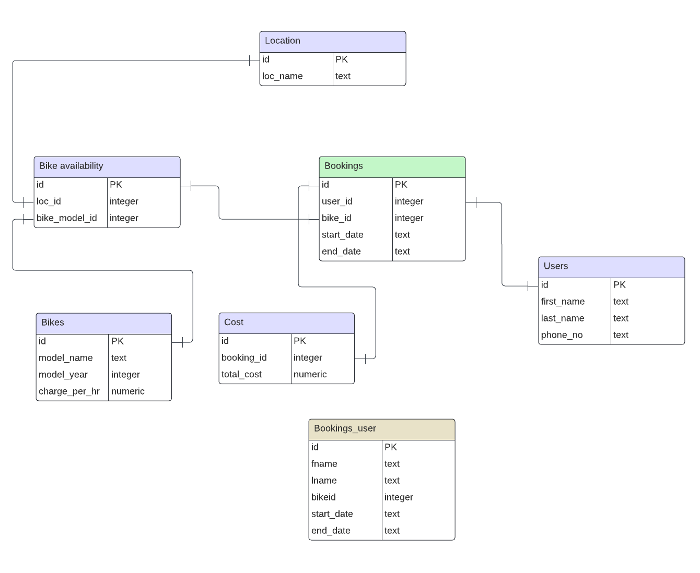

# Design Document

By Abhishikth Paul

Video overview: <https://youtu.be/5CCUjqV9Jac>

## Scope

The database of `bikerentals` is for a bike rental company that operates out of multiple locations. Included in the database’s scope is:
* Employees of the bike rental company who want to keep track of the bikes and bookings
* Users of the service, including basic identifying information
* Bikes, including the model_name, year and a unique id given to each bike
* Locations, including basic identifying information
* Bookings, including the name of the bike, the duration of the rental period (the start and end dates)

## Functional Requirements

This database will support the following functionalities-
* Users can view available bikes and make bookings using the `INSERT` operation on `Bookings` table.
* The system ensures that no two customers can book the same bike at the same time and location.
* It calculates the rental charge for each bike based on the specified duration.

## Representation

Entities are captured in SQLite tables with the following schema.

### Entities

The database includes the following entities:

#### Bikes

The `Bikes` table includes:

* `id`, which specifies the unique ID for the bike as an `INTEGER`. This column thus has the `PRIMARY KEY` constraint applied.
* `model_name`, which specifies the name of the bike as `TEXT`.
* `model_year`, which specifies the year in which that version of bike was released. This attribute is stored as `INTEGER`, which is enough for storing the year.
* `charge_per_hr`, which specifies the rate per hour of renting the bike. Since this value can include decimal places, it is stored as `NUMERIC` type.

#### Users

The `Users` table includes:

* `id`, which specifies the unique ID for the user as an `INTEGER`. This column thus has the `PRIMARY KEY` constraint applied.
* `first_name`, which specifies the user's first name as `TEXT`, given `TEXT` is appropriate for name fields.
* `last_name`, which specifies the user's last name as `TEXT`, given `TEXT` is appropriate for name fields.
* `phone_no`, stores the user’s phone number as a 10-digit string, making `TEXT` the most appropriate data type. A `UNIQUE` constraint ensures no two users have the same phone number.

#### Location

The `Location` table includes:
*   `id`, which specifies the unique ID for the location as an `INTEGER`. This column thus has the `PRIMARY KEY` constraint applied.
* `loc_name`, which stores the name of the specific branch of the bike rental company where a user can pick up the bike. It is stored as `TEXT` for the same reason.

#### Bike availability

The `Bike_availability` table includes:
* `id`, which specifies the unique ID for the bikes available at a location as an `INTEGER`. This column thus has the `PRIMARY KEY` constraint applied.
* `loc_id`, which is the ID of the location where the bike is available at, as an `INTEGER`. This column thus has the `FOREIGN KEY` constraint applied, referencing the `id` column in the `location` table to ensure data integrity.
* `bike_mode_id`, which is the ID of the model name of the bike as an `INTEGER`. This column thus has the `FOREIGN KEY` constraint applied, referencing the `id` column in the `bikes` table to ensure data integrity.

#### Bookings

The `Bookings` table includes:
* `id`, which specifies the unique ID for the bookings as an `INTEGER`. This column thus has the `PRIMARY KEY` constraint applied.
* `user_id`, which specifies the ID of the user who has done the booking as an `INTEGER`. This column thus has the `FOREIGN KEY` constraint applied, referencing the `id` column in the `users` table, which ensures each booking belongs to a particular user.
* `bike_id`, which specifies the ID of the particular bike the user has booked as an `INTEGER`. This column thus has the `FOREIGN KEY` constraint applied, referencing the `id` column in the `Bike_availability` table, which ensures each booking is associated with a specific bike available at a certain location.
* `start_date`, which specifies the start date of the booking. This is stored as a data type of `TEXT` since dates in SQLite  are stored as `TEXT`  in 'YYYY-MM-DD' format.
* `end_date`, which specifies the end date of the booking. This is stored as a data type of `TEXT` for the same reason as `start_date`.

#### Bookings user

The `Bookings_user` table is used by the user to book the bike, using the `INSERT` statement. It includes:
* `id`, which specifies the unique ID for the booking done by the user as an `INTEGER`. This column thus has the `PRIMARY KEY` constraint applied.
* `fname`, which specifies the first name of the user doing the booking as a `TEXT`.  This column thus has the `FOREIGN KEY` constraint applied, referencing the `first_name` column in the `users` table, which ensures each booking belongs to a particular user.
* `lname`, which specifies the last name of the user doing the booking as a `TEXT`.  This column thus has the `FOREIGN KEY` constraint applied, referencing the `last_name` column in the `users` table, which ensures each booking belongs to a particular user.
* `bikeid`, which specifies the ID of the particular bike the user has booked as an `INTEGER`. This column thus has the `FOREIGN KEY` constraint applied, referencing the `id` column in the `Bike_availability` table, which ensures each booking is associated with a specific bike available at a certain location.
* `start_date`, which specifies the start date of the booking. This is stored as a data type of `TEXT` since dates in SQLite  are stored as `TEXT`  in 'YYYY-MM-DD' format.
* `end_date`, which specifies the end date of the booking. This is stored as a data type of `TEXT` for the same reason as `start_date`.

There is also an additional `CHECK` constraint to ensure that the `start_date` and `end_date` are not equal to each other. 

#### Cost

The `Cost` table includes:
* `id`, which specifies the unique ID for the cost of the booking as an `INTEGER`. This column thus has the `PRIMARY KEY` constraint applied.
* `booking_id`, which specifies the first name of the user doing the booking as an `INTEGER`.  This column thus has the `FOREIGN KEY` constraint applied, referencing the `id` column in the `bookings` table, which ensures each booking belongs to a particular user.
* `total_cost`, which specifies the total cost the user has to pay for the rental. It is calculated as the product of `charge_per_hr` and the rental period, plus 28% tax. Since this can include decimal places, it is stored as `NUMERIC` type.

### Relationships

The below entity relationship diagram describes the relationships among the entities in the database.

## Triggers

* `concurrent_entry`: Ensures that whenever an entry is made in the `bookings_user` table (used by the user for booking a bike), a corresponding entry is made in the `bookings` table.
* `check_availability`: Checks whether the desired slot is available before inserting a record into the `bookings` table.
* `delete_booking_user`: Ensures that whenever a row is deleted from the `bookings` table, the corresponding row in the `bookings_user` table is also deleted.
* `delete_cost`: Ensures that whenever a row is deleted from the `bookings` table, the corresponding row in the `cost` table is also deleted.
* `amt_calc`: Calculates the rental amount whenever a new booking is made.

## Optimizations

Before booking, customers may want to view all available bikes and their rental costs per hour. To facilitate this, indexes are created on the `model_name` and `charge_per_hr` columns in the `bikes` table to speed up the query process.

Customers also need to know the locations where the bikes are available. Therefore, an index is created on the `loc_name` column in the `location` table.

During the booking process, customers use their first and last names. However, these names are converted into user IDs for storage in the bookings table. To optimize this conversion, indexes are created on the `first_name` and `last_name` columns in the `users` table.

A view called `booking_details` is created to store all the details of the booking, such as the user name, bike model, the start and end dates and the rental amount. This view simplifies tracking bookings by providing all relevant information in one place.

## Limitations

* Customers need to execute multiple queries to gather all the information required to book a bike.
* Customers cannot rent a bike for less than 24 hours or specify a rental period from a specific start time to a specific end time.
* Bikes that are rented out remain visible in the `bike_availability` table. However, the `check_availability` trigger prevents another person from booking the same bike during its rented period.

